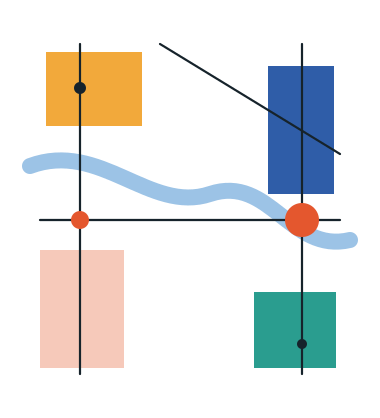

```{=html}
<div class="hero">
  <div class="hero-text">
    <p class="hero-name" aria-hidden="true">Oliver Harman</p>
    <p class="lede">I study how power and connection shape economic development:
    how power is distributed within developing countries, and how places connect
    to the global economy.</p>
    <p class="hero-links">
      <a href="cv/harman-cv-abridged.pdf">Abridged CV</a>
      <a href="cv/harman-cv-full.pdf">Full CV</a>
    </p>
  </div>
  <div class="hero-portrait">
    
    
  </div>
</div>
```

I am Lecturer in Urban Economics at the African School of Economics'
[Africa Urban Lab](https://www.asezanzibar.com/africa-urban-lab) in Zanzibar,
where I have taught since 2024, and
[Research Officer in Economic Geography and Spatial Economics](https://www.lse.ac.uk/people/oliver-harman)
at LSE's Department of Geography and Environment and Global School of
Sustainability. I am also a DPhil candidate in Sustainable Urban Development at the
University of Oxford, where I am a Doctoral Affiliate of the Centre for the
Study of African Economies and a Research Affiliate of the Blavatnik School of
Government.

[**Fields:** urban and regional economics; political economy of development;
global value chains and foreign direct investment. **Regions:** sub-Saharan
Africa and South Asia.]{.fields}

::: {.featured}
[Featured paper]{.label}

[Status without Power: The Political Economy of Administrative Unit Creation in Uganda]{.paper-title}

On 1 July 2020 Uganda's ten new cities commenced together, a reform that
changed their status and resources without decentralising formal authority.
This paper asks which dimensions of local power that change actually moves,
comparing the ten against cities that were declared but never commenced.

[More on my research](research.qmd#featured-paper) &nbsp; Draft available on request
:::

::: {.wip}
[Recently published]{.label}

- *[Unequal Progress and Barriers for Women in Economics](https://doi.org/10.21627/aekcyv04)*. [With [O. Berland](https://www.ondineberland.com/) and [N. Moreau-Kastler](https://ninonmoreaukastler.com/). Reviews of Economic Literature, 2026]{.with}

[In press]{.label}

- *Green Global Value Chains for Sustainable Regional Development*. [With [R. Crescenzi](https://www.lse.ac.uk/geography-and-environment/people/academic-staff/riccardo-crescenzi). Cambridge Elements, Cambridge University Press]{.with}

[Work in progress]{.label}

- *Measuring Metropolitan Authority in Africa: A Regional Authority Index for Five Countries, 1994–2024*. [With J. Hayward and G. Sampó]{.with}
- *Green Foreign Direct Investment in Africa*. [With [J. Alvarez-Vilanova](https://www.lse.ac.uk/geography-and-environment/people/phd-students/juan-alvarez-vilanova), [R. Crescenzi](https://www.lse.ac.uk/geography-and-environment/people/academic-staff/riccardo-crescenzi) and [C. Lippitsch](https://sites.google.com/view/christianlippitsch)]{.with}
- *Transforming SME Integration into Global Value Chains*. [With R. Shukla]{.with}
- *Degree of Urbanisation in Ethiopia*. [With [S. Franklin](https://www.simonfranklin.co/), G. Kakoulaki, K. Molla and M. Read]{.with}

[All working papers and abstracts](research.qmd#working-papers)
:::

On power, my thesis, *Power and Place*, asks how power is distributed within
African states and what follows for local economic development. I treat the
power of urban governments as three things that need not move together:
capacity, how well they perform in the eyes of their citizens; authority, what
the law formally grants them; and means, the fiscal resources behind both. I
measure each, drawing on two decades of Afrobarometer surveys, a model-assisted
coding of metropolitan legislation since the early 1990s, and IMF fiscal data,
and then trace what they do for local public goods and for Uganda's new cities,
where status and resources changed but formal authority did not. On connection, I ask how foreign
investment and global value chains land in particular regions, and whether
those regions capture anything durable from them as the economy turns green.

I came to research from a decade in policy. I worked with mayors, city
governments and national ministries across Africa, Asia and the Caribbean: as
Cities Economist and then Senior Policy Economist on the International Growth
Centre's [Cities that Work](https://www.theigc.org/initiatives/cities-work)
initiative, and before that as an ODI Fellow embedded in Guyana's Ministry of
Communities. I was focal point for city programmes with UN-Habitat, the
European Commission and the UK's FCDO, and my [policy research](policy.qmd)
has 61 externally validated instances of uptake by decision-makers across 27
countries.

I [teach](teaching.qmd) urban economics at the Africa Urban Lab and LSE, and
co-convened the BREAD-IGC virtual PhD course in urban economics with Edward
Glaeser. In 2026 I received the Class Teacher Award in LSE's Department of
Geography and Environment.

This site collects my [research](research.qmd), [teaching](teaching.qmd),
[policy research](policy.qmd) and [commentary](commentary.qmd).

My best email is <o.harman@lse.ac.uk>, and I am on
[Google Scholar](https://scholar.google.com/citations?user=SLb3QHIAAAAJ) and
[LinkedIn](https://www.linkedin.com/in/oharman/). If you are ever in London or
Oxford, I am nearly always available for a cup of tea.

## Updates

::: {.updates}
- [Jul 2026]{.date} ["Unequal Progress and Barriers for Women in Economics"](https://doi.org/10.21627/aekcyv04), with Ondine Berland and Ninon Moreau-Kastler, published in *Reviews of Economic Literature* (open access).
- [Jun 2026]{.date} ["Made in Britain, or designed in Britain? What Port Talbot teaches us about the green economy"](https://blogs.lse.ac.uk/businessreview/2026/06/13/made-in-britain-or-designed-in-britain-what-port-talbot-teaches-us-about-the-green-economy/), with Riccardo Crescenzi, in LSE Business Review.
- [May 2026]{.date} "Unequal Progress and Barriers for Women in Economics", with Ondine Berland and Ninon Moreau-Kastler, is in press at *Reviews of Economic Literature*.
- [Apr 2026]{.date} Four working papers submitted to the International Growth Centre.
- [Mar 2026]{.date} *Green Global Value Chains for Sustainable Regional Development*, with Riccardo Crescenzi, accepted for Cambridge Elements (Cambridge University Press).
- [Mar 2026]{.date} Presented a paper on public goods in Africa at the [CSAE Conference](https://www.csae.ox.ac.uk/), Oxford.
- [Jan 2026]{.date} Joint work [presented at ASSA](https://www.aeaweb.org/conference/2026/program/1519).
:::
