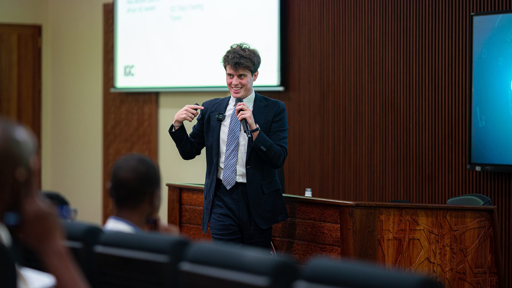

```{=html}
<figure class="page-photo marigold">
  
  <figcaption>Teaching at the Africa Urban Lab, Zanzibar</figcaption>
</figure>
```

I teach urban economics to undergraduates at LSE, where in 2026 I received the
Class Teacher Award in the Department of Geography and Environment, having been
nominated by the LSE Students' Union for Outstanding Teacher of the Year the
year before. Alongside my LSE role, I have been Lecturer in Urban Economics at
the Africa Urban Lab of the African School of Economics in Zanzibar since 2024,
where I co-created and teach the urban economics module of its Professional
Diploma for mid-career urban professionals from across Africa. I also
co-convened a global PhD course in urban economics.

## Teaching interests

Urban and regional economics; global value chains and foreign direct
investment; economic geography; the political economy of development and of
local government; and using economics in government.

## Courses

::: {.pubs}
- **The Economics of Cities (GY210)** (2024–2026)
  [Guest teacher. BSc second and third year, Department of Geography and Environment, LSE. Convened by Prof. Henry Overman]{.venue}
  [Class Teacher Award, selected by the Head of Department (2026). Nominated for Outstanding Teacher of the Year by the LSE Students' Union (2025). Rated 4.9/5 (2026) and 4.6/5 (2025).]{.desc}
  [[Student feedback](#feedback-lse)]{.links}

- **BREAD-IGC Virtual PhD Course on Urban Economics** (2024)
  [Co-convener and co-host, with faculty lead Prof. Edward Glaeser]{.venue}
  [A nine-week certified course for PhD students. 1,436 students from 91 countries took part; 99% were satisfied, and 78% said the course affected their research trajectory.]{.desc}
  [[Reading lists and lectures](https://www.theigc.org/events/bread-igc-virtual-phd-course-urban-economics) [Student feedback](#feedback-bread)]{.links}

- **Urban Economics** (2024–2026)
  [Lecturer in Urban Economics and module co-creator. Professional Diploma, Africa Urban Lab, African School of Economics, Zanzibar]{.venue}
  [Teaches the principles of urban economics and their applied usefulness in urban development, to mid-career urban professionals from across Africa.]{.desc}
  [**2024 cohort:** rated 4.3/5 as lecturer; 92% rated the module very valuable.]{.edition}
  [**2025 cohort:** rated 4.8/5 as lecturer and 4.6/5 for the module; 98% rated it very valuable.]{.edition}
  [[Student feedback](#feedback-ase)]{.links}

- **Using Economics in Government** (2023–2025)
  [Seminar leader. BSc third year, School of Politics and Economics, King's College London. Convened by Dr Maia King]{.venue}
  [Cohorts of 34, 44 and 46 students, with responsibility for marking. Rated 4.2/5 (2023), 4.8/5 (2024) and 4.7/5 (2025).]{.desc}
  [[Student feedback](#feedback-kcl)]{.links}

- **Winter School on Urban and Regional Economics in Africa** (2025)
  [Organising committee. University of Cape Town, with ERSA, the IGC and the World Bank]{.venue}
  [[Reading list and lectures](https://www.theigc.org/events/winter-school-urban-and-regional-economics-africa)]{.links}
:::

```{=html}
<figure class="page-photo coral">
  
  <figcaption>On a field visit with Africa Urban Lab students, Stone Town, Zanzibar</figcaption>
</figure>
```

## What students say {#feedback}

### The Economics of Cities (GY210), LSE {#feedback-lse}

::: {.quote-lead .coral}
"Oliver demonstrates exceptional dedication to his students, going above and beyond to ensure comprehensive understanding for every learner, including adapting to individual circumstances and learning differences. Described as 'the best' by students, his passionate delivery, particularly clear explanations of difficult concepts, and willingness to take on feedback and adapt his teaching approach exemplifies inspiring practice in education."
[Head of Department]{.who}
:::

<details class="more">
<summary>More from students</summary>

- "Always upbeat and honest, reflective and adapts class format to student feedback - really have enjoyed class with Oliver!"
- "Oliver was incredibly dedicated as a teacher and went above and beyond in ensuring comprehensive understanding for each student including working around any learning / circumstance differences [...]"
- "I really appreciated your teaching style -- it was obvious you're knowledgeable and passionate about the subject and you've prepared me well for the exam."
- "You were a phenomenal teacher who explained all the concepts very well and created a comfortable learning environment. Of all my classes this was the best taught and the one I felt most welcome in...."
- "Very engaging and good at explaining problem sets"
- "Articulates himself very well and makes difficult concepts seems simple."
- "clear teaching, related concepts to real world applications"
- "extremely helpful"
- "teaching style is effective."
- "passionate and dedicated to his lessons"
- "very engaging and good at explaining difficult concepts"
- "Amazing teacher".

</details>

### BREAD-IGC Virtual PhD Course on Urban Economics {#feedback-bread}

::: {.quote-lead .sea}
"the lectures were insightful, and the discussions truly expanded my understanding of urban economic dynamics"
[Course participant]{.who}
:::

### Urban Economics, Africa Urban Lab {#feedback-ase}

Feedback on the module as a whole, which is taught by a team of lecturers.

::: {.quote-lead .marigold}
"your teachings truly sparked my passion for urban economics. It completely reshaped my perspective and is the main reason I have decided to pursue this specific route for my doctoral research."
[Town Planner, South Africa]{.who}
:::

<details class="more">
<summary>More from the 2025 cohort</summary>

- "An unforgettable learning moment." [Urban Advisor to the Prime Minister, Senegal]{.who}
- "Based on the quality and relevance of the content, this is a masterpiece […] We have learned things that we never covered even at the master's level. […] The facilitators are passionate about what they do and genuinely want to see us grow." [Researcher, Uganda]{.who}
- "The past couple of weeks have been nothing short of incredible!" [Policy Analyst, Kenya]{.who}
- "We also covered Urban Economics, the dismal science, my experience was anything but." [Urban Developer, Kenya]{.who}
- "I want to thank you once again for the life-time impact you guys have made on my life as an urban planner." [Urban Planner, Ghana]{.who}
- "What strikes me in hindsight is how transferable this experience is to the field." [Urban Planner, Togo]{.who}
- "one of the most meaningful experiences of my life" [Economic Development Analyst, Nigeria]{.who}
- "Literally the best instructors that I have ever come across."
- "This is the most interesting urban economics class I've attended so far"
- "I actually never knew that I'd understand urban economics in 2 weeks"
- "I would say you selected the right set of teachers, rich with content, yet approachable!"
- "I found it more than working a years of degree."
- "I had the privilege of learning under some of the world's best lecturers whose impact will be felt for years to come."
- "hands-down one of the most worthwhile investments you can make in your career in urban development."

</details>

<details class="more">
<summary>More from the 2024 cohort</summary>

- "The course has deeply enlightened not only my understandings in urban economics, but it made me fully aware of the fragmented economies in Africa's growing cities" [Mayor, Degahbour City Administration, Ethiopia]{.who}
- "Studying urban economics through an international lens has taught me the importance of context specific policies while highlighting universal principles like supply and demand, equity, innovation, and stakeholder collaboration." [Chief Planner, Ministry of Local Government and Rural Development, Zambia]{.who}
- "By studying different city models and fiscal strategies, I've gained valuable insights into designing urban policies that are both context-specific and globally informed." [Assistant Director, State Department of Housing and Urban Development, Kenya]{.who}
- "I want to thank all three instructors for their unwavering attention and commitment to teaching us urban economics"
- "They are super brilliant in providing real world applications"
- "Understanding how policies are made and the evaluation process behind it... has taught me to be more critical of the policies that will be brought up in my country"

</details>

### Using Economics in Government, King's College London {#feedback-kcl}

::: {.quote-lead .cobalt}
"Maia's and your course and teaching provided me with the best learning experience at King's so far."
[Student]{.who}
:::

<details class="more">
<summary>More from students</summary>

- "I was deeply inspired by your expertise and genuinely appreciated the way you conducted your course, which greatly enriched my academic experience."
- "I don't think I've ever had such detailed feedback"
- "I felt comfortable talking to Oliver as not only is he very clear in his points but [...] very personable, happy and open to help"

</details>

## Guest lectures

::: {.pubs}
- **Green global value chains for sustainable regional development** (2025–2026)
  [Stanford–Oxford Week on Sustainability Changemakers, Magdalen College, University of Oxford]{.venue}

- **Funding fast-growing cities in developing countries** (2024)
  [MSc Sustainable Urban Development, Department for Continuing Education, University of Oxford]{.venue}

- **Using urban economics research in government** (2023–2024)
  [Using Economics in Government, BSc and MSc, King's College London]{.venue}

- **Sustainable urbanisation in developing countries** (2023)
  [Sustainability and Society, BA, Adelphi University, New York]{.venue}

- **Sustainable urbanisation** (2021–2022)
  [Invited speaker, Blavatnik School of Government, University of Oxford]{.venue}
:::

## Student support and mentoring

::: {.pubs}
- **IGC PhD Summer Placement** (2024–2025)
  [Co-creator and co-organiser. Addis Ababa (2024) and global (2025)]{.venue}

- **Young Urban Economist Workshop** (2023–2025)
  [Co-organiser. Early career researchers present to senior faculty at the 7th, 8th and 9th Urbanisation and Poverty Reduction Research Conferences, Washington DC and Cape Town]{.venue}

- **Freetown City Council MPP Summer Placement** (2021–2022)
  [Co-creator and co-organiser, with the Blavatnik School of Government and Freetown City Council, Sierra Leone]{.venue}

- **Feedback and matchmaking, IGC Bangladesh Young Economists** (2023)
  [Resilient and Resurgent Bangladesh Conference, Dhaka]{.venue}

- **Mentor** (2021–2024)
  [Oxford Society for International Development, University of Oxford]{.venue}

- **College Advisor and Tutor** (2021–2022)
  [St Antony's College, University of Oxford]{.venue}
:::
